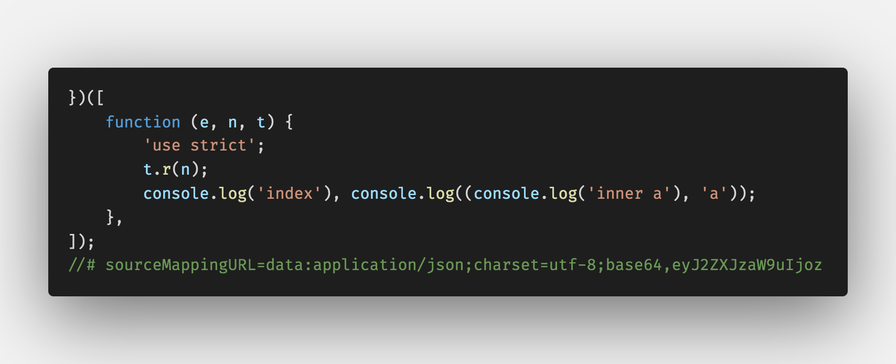
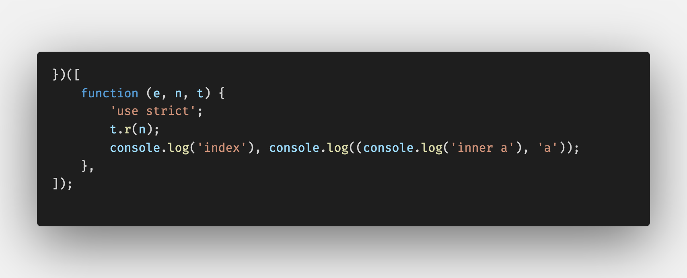
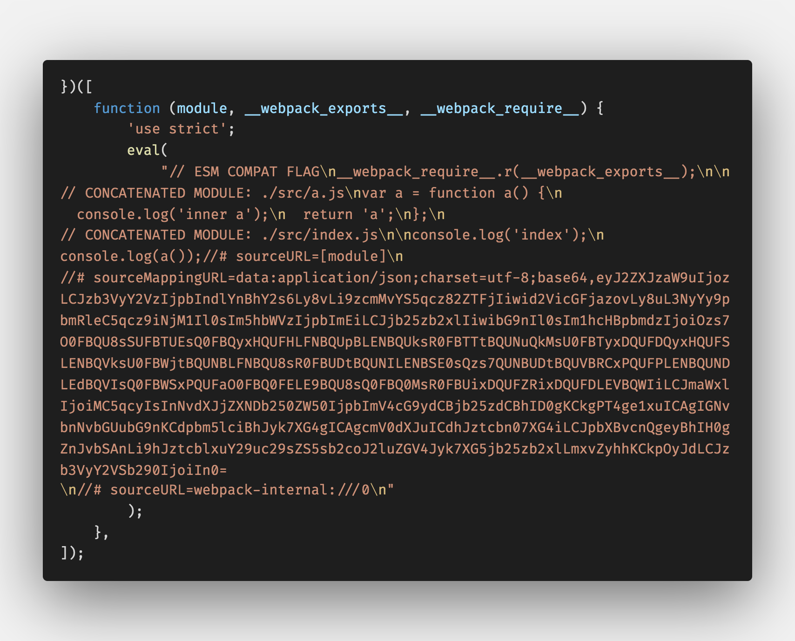
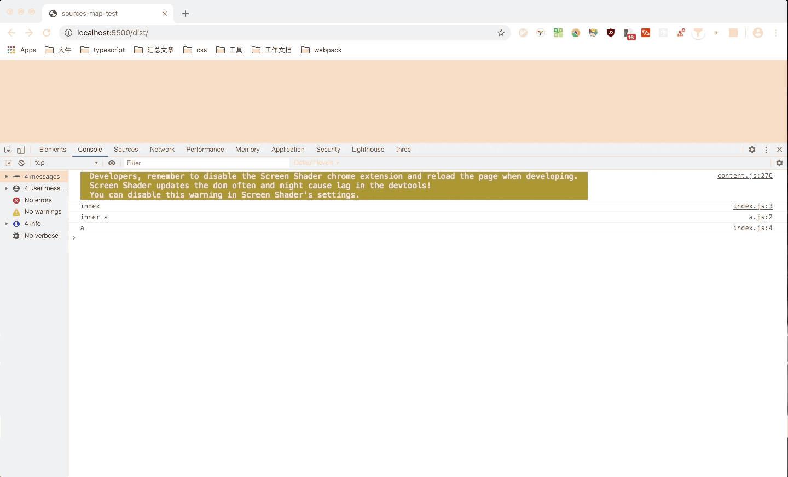
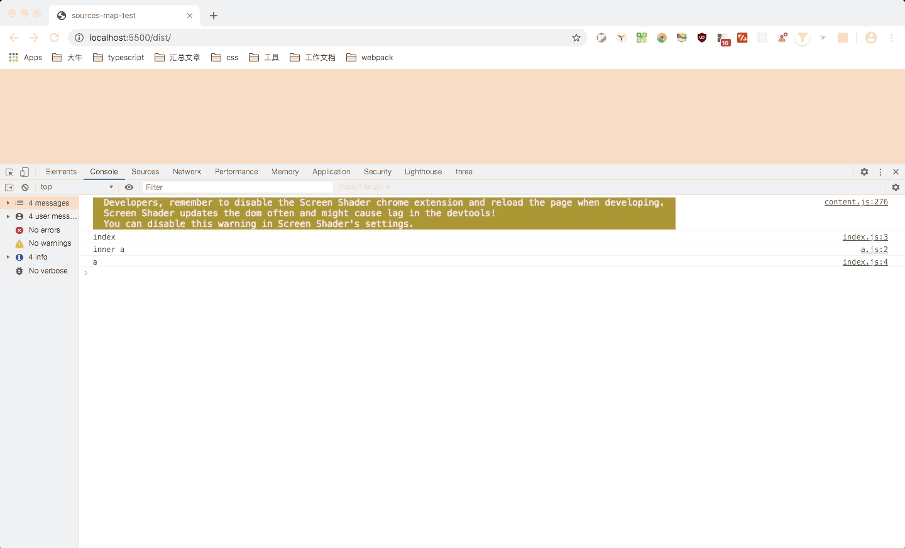

# 前端工程化

## Webpack

### 打包流程

1. 初始化参数：从配置文件和命令语句中读取并合并参数，得到最终的参数
2. 开始编译：根据参数初始化`Compiler`对象，加载所有配置的插件，开始编译
3. 确定入口：根据配置中的`entry`找出所有入口文件
4. 编译执行：从入口文件开始解析，找到其导入的依赖模块，递归遍历解析，对不同文件类型的依赖模块使用对应的`Loader`进行翻译，得到每个模块被翻译后的内容以及它们之间的依赖关系
5. 输出资源：根据入口和模块之间的依赖关系，组装成一个个包含多个模块的`Chunk`，再把每个`Chunk`转换成一个单独的文件放到输出列表，最后根据配置文件确定输出路径和文件名，将输出列表写入到对应路径上

整个过程中`Webpack`会通过发布订阅模式，在特定的时间点广播特定的事件，而插件可通过监听这些特定事件，执行插件自身的逻辑达到干预输出结果的目的。

`compiler` 对象是一个全局单例对象，负责把控整个打包的构建流程。每一次构建都会生成一个 `compilation` 对象，它包含当前构建所需要的所有信息。

### sourceMap

`sourceMap` 是一项将编译、打包、压缩后的代码映射回源代码的技术。

既然是一种源码的映射，那就需要有一份映射的文件，来标记混淆代码里对应源码的位置，通常这份文件以 `.map` 结尾，里边的数据结构大概长这样：

```json
{
  "version": 3, // Source Map版本
  "file": "out.js", // 输出文件（可选）
  "sourceRoot": "", // 源文件根目录（可选）
  "sources": ["foo.js", "bar.js"], // 源文件列表
  "sourcesContent": [null, null], // 源内容列表（可选，和源文件列表顺序一致）
  "names": ["src", "maps", "are", "fun"], // mappings使用的符号名称列表
  "mappings": "A,AAAB;;ABCDE;" // 带有编码映射数据的字符串
}
```

包括 `sourceMap` 版本、源文件、输出文件等信息。

在压缩代码的末端会有一段注释：

```
//# sourceMappingURL=bundle.js.map
```

这段注释标记了映射文件的地址，浏览器会通过 `sourceMappingURL` 去获取这份映射文件，通过解释器解析后，实现源码和压缩代码之间的映射。

#### quality

- `bundle code`：模块未分离
- `generated code`：模块分离，未经 `loader` 转译的代码
- `transformed code`：模块分离，经过 `loader` 转译的代码
- `original source`每个模块相互分离，代码如同编写时一样
- `without source content`：生成的 `Source Map` 中不包含 `sourcesContent`

#### mode

- `inline`：`Source Map` 内容通过 `base64` 放在 `js` 文件中引入
  
- `hidden`：代码中没有 `sourceMappingURL`，浏览器不自动引入 `Source Map`
  
- `eval`：生成代码和 `Source Map` 内容混淆在一起，通过 `eval` 输出
  
- `nosources`：`Source Map` 不包含 `sourcesContent`，调试时只能看到文件信息和行信息，无法看到源码
  
- `cheap`：不包含列信息，并且源码经过 `loader` 处理
  
- `cheap-module`：不包含列信息，但是源码未经过任何处理
  

### Loader

由于 `Webpack` 内部默认只能处理 `js` 模块代码，在打包过程中，会把所有遇到的文件都当作 `js` 代码进行解析，因此当项目存在非 `js` 类型文件时，需要先对其进行转换再继续解析，而 `Loader` 就是用于转换非 `js` 类型文件。

#### 编写 Loader 准则

- 简单：任务单一
- 链式调用：最后一个 `Loader` 需要返回 `webpack` 期望的 `js` 模块，而其他 `Loader` 可以返回任意类型的模块，只要下一个 `Loader` 可以处理
- 无状态：确保 `Loader` 在不同模块之间不保存状态，每次运行都应该独立于其他编译模块以及相同模块之前的编译结果

#### 常用 loader

- `css-loader`：解析.css 后缀文件，支持文件导入`@import`等特性
- `style-loader`：将 css 代码通过`style`标签注入到 DOM 中
- `less-loader`：解析.less 后缀文件，将 less 语法转换为 css 语法，生成.css 文件
- `postcss-loader`：处理 css 属性浏览器兼容问题
- `file-loader`：处理文件导入地址将其替换成访问地址，并将文件输出到相应位置
- `url-loader`：与 `file-loader` 类似，但是可以配置文件大小限制，决定文件是否以 base64 方式注入到代码中、
- `babel-loader`：语法转换

### Plugin

插件负责功能拓展，在打包的整个生命周期中通过监听特定的事件去执行插件自身的任务，从而达到插件想要的目的。

一个 `webpack` 插件由以下组成：

- 一个 `Javascript` 命名函数或 `Javascript` 类
- 在插件函数的 `prototype` 上定义一个 `apply` 方法，用于访问 `compiler` 实例
- 指定一个绑定到 `webpack` 自身的事件钩子
- 处理 `webpack` 内部实例的特定数据
- 功能完成后调用 `webpack` 提供的回调，通知 `webpack` 继续进行打包流程

#### 常用 Plugin

- `html-webpack-plugin`：将打包后的 js 文件自动引入 html 中
- `webpack-dev-server`：在本地建立一个 http 服务
- `clean-webpack-plugin`：每次打包前先清理 dist 目录
- `copy-webpack-plugin`：将静态资源复制到 dist 目录中
- `webpack-bundle-analyzer`：可视化打包文件的体积大小

### 搭建 React+TypeScript 脚手架
